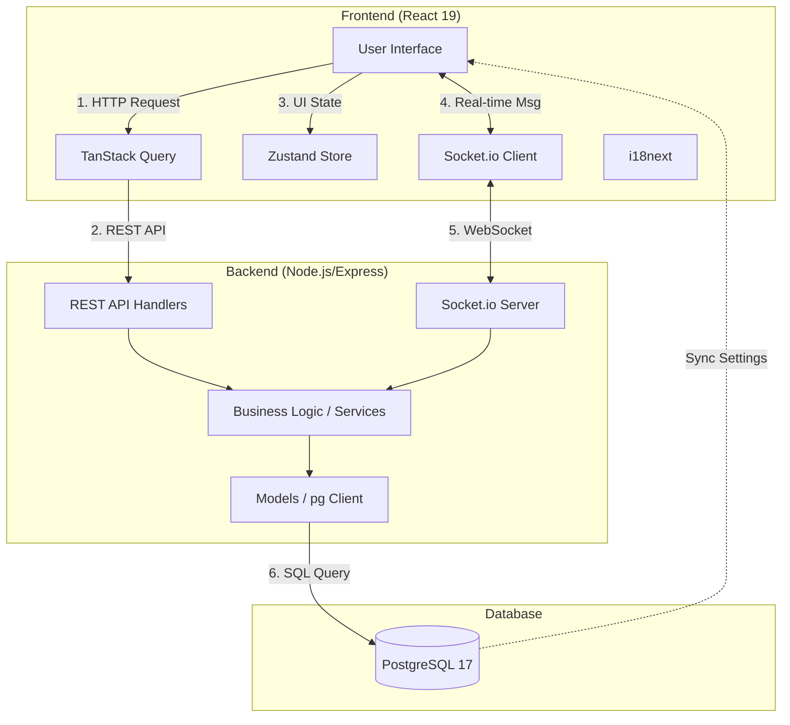

# 기술 아키텍처 다이어그램 (Technical Architecture Diagram)

**Version**: v1.0.0 (Based on PRD v2.0.0)  
**Status**: Finalized

## 1. 시스템 아키텍처 개요
Team CalTalk은 React 기반의 단일 페이지 애플리케이션(SPA)과 Node.js 기반의 RESTful API 및 WebSocket 서버로 구성된 단순하고 효율적인 아키텍처를 가집니다.

## 2. 주요 아키텍처 구성 요소

### 2.1 프론트엔드 (Frontend)
- **React 19**: 컴포넌트 기반의 UI 구축 및 최신 훅(use) 활용.
- **TanStack Query**: 서버 상태 관리, 캐싱, API 동기화 및 낙관적 업데이트(Optimistic Updates) 처리.
- **Zustand**: 클라이언트 전역 상태(테마 설정, UI 모달 상태 등)를 관리하며, 서버에서 받아온 설정값을 유지.
- **Socket.io Client**: 일자별 실시간 채팅 및 알림 수신을 위한 상시 연결 유지.

### 2.2 백엔드 (Backend)
- **Express**: 가볍고 빠른 API 서버 구축.
- **Socket.io Server**: 서버-클라이언트 간 양방향 실시간 통신 및 방(Room) 관리 (날짜별 채팅방).
- **Layered Architecture**: Controller(요청 처리), Service(비즈니스 로직), Model(DB 접근)로 계층을 분리하여 유지보수성 확보.
- **pg (PostgreSQL Client)**: Prisma 등 무거운 ORM 대신 가벼운 pg 라이브러리를 사용하여 쿼리 성능을 극대화.

### 2.3 데이터베이스 (Database)
- **PostgreSQL 17**: 관계형 데이터베이스로, 모든 비즈니스 데이터(팀, 일정, 채팅, 설정)의 영구 저장소 역할.
- **Indicies**: 1,000명 동시 접속을 고려하여 `date`, `team_id`, `invite_code` 필드에 인덱스 최적화.

## 3. 핵심 데이터 흐름

1.  **초기 로드**: 사용자가 접속 시 JWT 인증을 통해 서버에서 개인 설정(테마, 언어)을 가져와 `Zustand`에 반영함.
2.  **일정 조회/수정**: `TanStack Query`를 통해 REST API를 호출하고, DB 데이터를 비동기적으로 UI에 렌더링함.
3.  **실시간 채팅**: 사용자가 메시지를 전송하면 `Socket.io`를 통해 서버에 전달되고, 서버는 DB 저장 후 동일한 날짜에 접속 중인 다른 팀원들에게 메시지를 브로드캐스팅함.
4.  **변경 요청**: 팀원의 요청이 API를 통해 전달되면 팀장에게 WebSocket 알림을 보내고, 팀장이 승인 시 DB를 업데이트한 후 모든 팀원의 캘린더를 실시간 동기화함.
