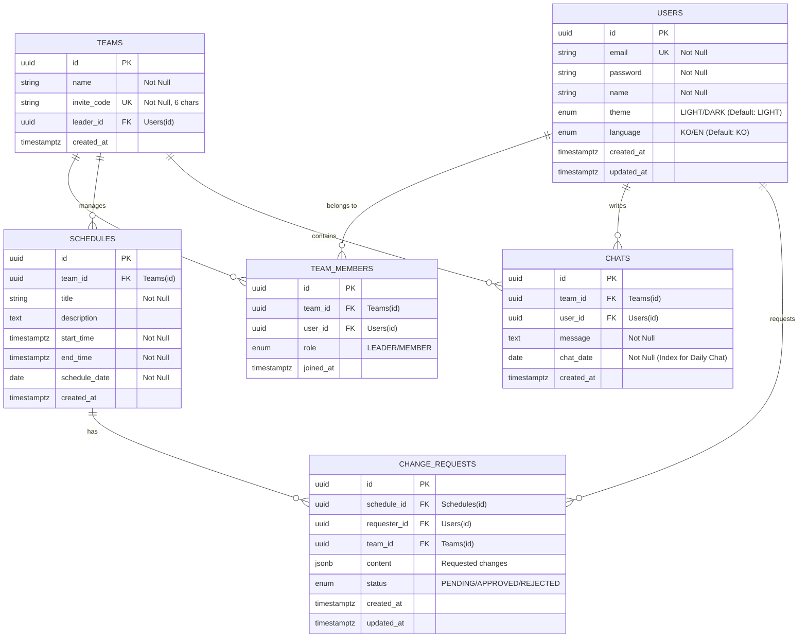

# 데이터베이스 ERD (Entity Relationship Diagram)

**Version**: v1.0.0 (Based on PRD v2.0.0)  
**Status**: Finalized

## 1. ERD (Mermaid)

## 2. 데이터 타입 및 제약 사항
- **Primary Key**: 확장성과 보안을 위해 `UUID` (PostgreSQL 17 `gen_random_uuid()`)를 사용한다.
- **Time Zone**: 모든 일시는 `TIMESTAMPTZ`를 사용하여 글로벌 시간대를 대응한다.
- **Enumerated Types (ENUM)**:
    - `user_theme`: `LIGHT`, `DARK`
    - `user_language`: `KO`, `EN`
    - `member_role`: `LEADER`, `MEMBER`
    - `request_status`: `PENDING`, `APPROVED`, `REJECTED`
- **ChangeRequests.content**: 변경될 제목, 시간 등 유연한 데이터 구조를 위해 `JSONB` 타입을 사용한다.

## 3. 성능 최적화 (인덱스 전략)
1,000명 동시 접속 및 실시간 조회를 고려하여 다음 필드에 인덱스를 생성한다:
1.  **Teams**: `invite_code` (Unique Index) - 팀 가입 시 빈번한 조회.
2.  **TeamMembers**: `(user_id, team_id)` (Composite Index) - 내 소속 팀 목록 및 권한 확인.
3.  **Schedules**: `(team_id, schedule_date)` (Composite Index) - 특정 팀의 특정 날짜 일정 필터링.
4.  **CHATS**: `(team_id, chat_date)` (Composite Index) - **일자별 실시간 채팅** 로딩 성능 최적화.
5.  **ChangeRequests**: `(team_id, status)` - 팀장의 대기 중인 요청 목록 조회 최적화.
6.  **Users**: `email` (Unique Index) - 로그인 시 사용자 식별.

## 4. 비즈니스 무결성 규칙
- `TEAMS.leader_id`는 반드시 `USERS` 테이블의 유효한 `id`여야 한다.
- `TEAM_MEMBERS` 테이블은 `(team_id, user_id)` 유니크 제약 조건을 통해 중복 가입을 방지한다.
- `CHATS.chat_date`는 캘린더의 일자 클릭 시 해당 일자의 대화만 불러오기 위한 핵심 파티션/필터링 필드로 관리한다.
